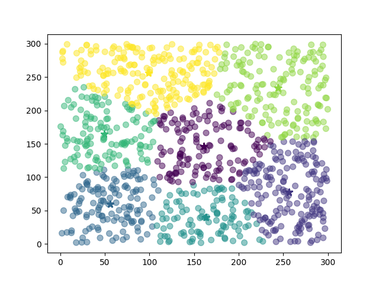

# k-means-hadoop

k-means clustering with Apache Hadoop

### Build
```
mvn clean install
hadoop jar target/k-means.jar \
            PATH_INPUT \
            PATH_OUTPUT \
            NUM_K \
            NUM_COORDINATES \
            THRESHOLD
```
Example
```
hadoop jar target/k-means.jar \
            input \
            output \
            7 \
            3 \
            0.0005
```

### Usage

Generate the points (x;y , x;y;z etc.) for the data_set with the python script *generatePoints.py* (parameters, numPoints, range).
```
python generatePoints.py 3 5 50 # 5 3d points in -50..50 range
```
Output in *input/data_set*:
```
21.6041331095;8.46492932874;39.6766968839;
11.9148005581;47.8849166781;17.8483647205;
19.9629853313;2.6589522782;20.4473549181;
44.7893224782;39.1567505862;39.7058609459;
26.9080526686;24.6560481195;32.782580723;
```

Import as a Maven project
The main class is *KMeans.java* and the args are:
+ input folder
+ output folder
+ number of clusters *K*
+ number of parameters
+ threshold 

Use *plot2d.py* or *plot3d.py* to plot the results

---

Example with k = 7, 1000 points
```
python generatePoints.py 2 1000 300
```


Example with k = 5, 1000 points
```
python generatePoints.py 3 1000 100
```

